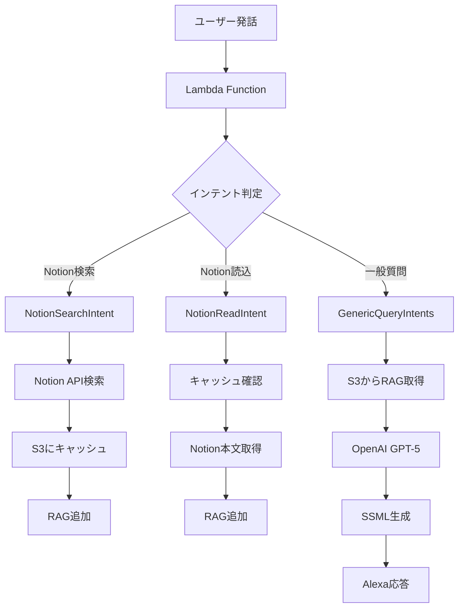

# Alexa GPT-5 Chat Assistant with Notion Integration & RAG

Amazon AlexaスキルとOpenAI GPT-5-chat-latest、Notion API、S3ベースRAGを統合した高度な対話型AIアシスタント「ぴこ」

## 🚀 主要機能

- **OpenAI GPT-5統合**: 最新のGPT-5-chat-latestモデルによる自然な対話
- **Notion検索・読み込み**: ナレッジベースからの情報取得
- **RAG（Retrieval-Augmented Generation）**: コンテキストを強化した回答生成
- **S3データ永続化**: ユーザー別の会話履歴とRAGデータの保存
- **多言語対応**: 日本語・英語の完全サポート

## 📋 現在の実装状況

### システム構成
```
モジュール化されたアーキテクチャ：
- lambda_function.py  : メインハンドラー（339行）
- convo_core.py      : 会話コア機能（99行）
- notion_utils.py    : Notion API統合（95行）
- rag_store_s3.py    : S3 RAGストレージ（102行）
- config.py          : 設定管理（61行）
- utils.py           : OpenAI基本ユーティリティ（37行）
```

### 環境設定
```python
# OpenAI設定
OPENAI_MODEL = "gpt-5-chat-latest"
_OPENAI_API_KEY = "sk-proj-xxxxx"

# Notion API設定
NOTION_TOKEN = "ntn_xxxxx"
NOTION_VERSION = "2022-06-28"

# S3設定（Alexa Hosted標準）
S3_BUCKET = "alexa-hosted-bucket-id"
S3_PREFIX = "Media"

# パフォーマンスチューニング
HTTP_TIMEOUT_SEC = 2.0      # API呼び出しタイムアウト
HARD_DEADLINE_SEC = 4.8     # Lambda処理制限
MAX_HISTORY_TURNS = 6       # 会話履歴保持数
NOTION_SEARCH_LIMIT = 3     # Notion検索結果上限
NOTION_SNIPPET_CHARS = 300  # 抽出文字数
```

### キャラクター設定

「ぴこ」は元気で可愛い相棒アシスタント：
- 一人称：「ぼく」
- 語尾：やわらかく（〜だよ/〜だね/〜かな）
- 最初は50〜100字で要点を伝える
- 絵文字・顔文字・URLは使用しない
- 具体例は短く提供
- 必要に応じて次の提案を一言添える

## 🏗️ アーキテクチャ

### モジュール構成と責務

#### 1. **lambda_function.py** - メインハンドラー
- Alexaリクエストのルーティング
- インテントハンドラーの管理
- セッション管理

#### 2. **convo_core.py** - 会話処理コア
- OpenAI API統合
- SSML安全化処理
- 会話履歴管理
- システムプロンプト管理

#### 3. **notion_utils.py** - Notion統合
- ページ検索API呼び出し
- ページ内容抽出（最初の300文字）
- タイトル・URL取得

#### 4. **rag_store_s3.py** - RAGストレージ
- ユーザー別データ永続化
- RAGスニペット管理（最大40件）
- Notion検索結果キャッシュ
- タイムスタンプ付き履歴

#### 5. **config.py** - 設定管理
- 環境変数の階層的読み込み
- .envファイルサポート
- デフォルト値管理

### データフロー


### SSML安全化処理
- 制御文字の削除
- URLを「リンク」に置換
- 絵文字の除去（TTS互換性のため）
- 改行をSSMLの`<break>`タグに変換
- 句点の自動付与（無音回避）

## 📝 対応インテント

### メインクエリインテント
以下のインテントはすべて`GenericQueryIntentsHandler`で処理：
- **GptQueryIntent** - 基本的な質問
- **CreativeIntent** - 創作・作成
- **EntertainmentIntent** - エンタメ
- **EmotionalIntent** - 感情的応答
- **AnalysisIntent** - 分析・評価
- **HelpIntent** - アドバイス
- **PhilosophicalIntent** - 哲学的思考
- **PracticalIntent** - 実践的ガイド
- **DetailRequestIntent** - 詳細リクエスト
- **NavigationIntent** - ナビゲーション
- **SelectionIntent** - 選択

### Notion統合インテント（新機能）
- **NotionSearchIntent**: Notionページの検索
  ```
  「Notionで React を検索して」
  → 上位3件のタイトルを返答、結果をS3にキャッシュ
  ```
- **NotionReadIntent**: Notionページの本文読み込み
  ```
  「1件目の本文を読んで」
  「最初の本文を読んで」
  「真ん中のやつを読んで」
  → ページの最初300文字を要約して返答、RAGストアに追加
  ```

### 特殊インテント
- **RefineIntent**: 条件を追加して絞り込み
- **ContinuationIntent**: 会話の続きや詳細を要求
- **TestIntent**: S3接続とデータ永続化の動作確認

### システムインテント
- **AMAZON.HelpIntent**: 使い方の説明
- **AMAZON.StopIntent/CancelIntent**: スキル終了
- **AMAZON.NavigateHomeIntent**: ホームに戻る
- **AMAZON.FallbackIntent**: 聞き取れなかった場合

## 🔄 会話フロー

### 1. 通常の質問処理（RAG強化）
```
1. ユーザー入力を受信（スロット値から取得）
2. S3からRAGスニペット取得（最新5件）
3. デッドライン（4.8秒）チェック
4. OpenAI APIを呼び出し（2秒タイムアウト）
5. 成功時：応答を返却、履歴に追加
6. 失敗時：「続けて」メッセージでリトライを促す
```

### 2. Notion検索フロー（NotionSearchIntent）
```
1. 検索クエリを受信
2. Notion APIで検索（最大3件）
3. 結果をS3にキャッシュ保存
4. RAGストアに追加（将来の参照用）
5. タイトル一覧を音声で返答
```

### 3. Notion読み込みフロー（NotionReadIntent）
```
1. 番号/位置/タイトルを解析
2. S3キャッシュから該当ページを特定
3. Notion APIで本文の最初300文字を取得
4. RAGストアに追加
5. 要点を音声で返答
```

### 4. 継続処理（ContinuationIntent）
```
1. pending_promptがあればそれを使用
2. なければ最後のユーザー発話から継続プロンプトを生成
3. RAGスニペットを付加
4. 「続きと詳細を短く」を付加して処理
```

### 5. 絞り込み処理（RefineIntent）
```
1. フィルター条件をスロットから取得
2. 元のプロンプトに条件を追加
3. RAGスニペットを付加
4. 「要点だけ短く」を付加して処理
```

## 🚀 セットアップ

### 1. 必要なAPIキーと設定

#### 必須設定
```bash
# .envファイルまたは環境変数で設定

# OpenAI API（必須）
_OPENAI_API_KEY=sk-proj-xxxxxxxxxxxxx

# Notion API（オプション - Notion機能を使う場合）
NOTION_TOKEN=ntn_xxxxxxxxxxxxx
NOTION_VERSION=2022-06-28

# S3設定（Alexa Hosted環境では自動設定）
S3_BUCKET=your-alexa-hosted-bucket
S3_PREFIX=Media
```

#### 設定方法

**方法1: .envファイル（開発環境）**
```bash
cd lambda
cp .env_sample .env
# .envファイルを編集して各キーを設定
```

**方法2: Alexa開発者コンソール**
1. [Alexa開発者コンソール](https://developer.amazon.com/alexa/console/ask)にログイン
2. スキルを選択 → 「コード」タブ
3. `.env`ファイルを作成または編集
4. 「デプロイ」ボタンをクリック

**方法3: AWS Lambda環境変数（本番環境推奨）**
1. AWS Lambdaコンソール → 設定 → 環境変数
2. 各キーと値を追加
3. 保存

### 2. デプロイ手順

#### Alexa Hosted環境（推奨）
```bash
# Alexa開発者コンソールから直接デプロイ
1. コードエディタで変更を行う
2. 「保存」ボタンをクリック
3. 「デプロイ」ボタンをクリック
```

#### AWS CLI使用（カスタムLambda環境）
```bash
# 全ファイルを含むZipファイル作成
cd lambda
zip -r lambda-function.zip *.py requirements.txt .env_sample

# Lambda関数を更新
aws lambda update-function-code \
    --function-name AlexaGptSkill \
    --zip-file fileb://lambda-function.zip \
    --region us-west-2

# 依存関係の更新が必要な場合はLayerも更新
pip install -r requirements.txt -t python/
zip -r layer.zip python/
aws lambda publish-layer-version \
    --layer-name alexa-gpt-dependencies \
    --zip-file fileb://layer.zip
```

### 3. スキルの起動
- 日本語: 「アレクサ、ぴこを開いて」
- 英語: "Alexa, open pico assistant"

## 🧪 テストシナリオ

### 基本動作
```
「アレクサ、ぴこを開いて」
→ "ぴこだよ。なんでも聞いてみて！"

「AIについて教えて」
→ GPT-5の応答（50-100字程度、RAGコンテキスト付き）

「もっと詳しく」
→ 詳細な説明が返る
```

### Notion統合テスト
```
「Notionで React Hooks を探して」
→ "Notionの上位3件だよ。1件目、React Hooks入門..."

「2件目の本文を読んで」
→ "『React Hooksパターン』の要点だよ。useStateは..."

「最初のやつを読んで」
→ "『React Hooks入門』の要点だよ..."
```

### S3永続化テスト
```
「テストして」（TestIntent）
→ "S3保存 OK。通し番号は 1 回目だよ。"

「テストして」（再度実行）
→ "S3保存 OK。通し番号は 2 回目だよ。"
```

### タイムアウト処理
```
長い処理が必要な質問
→ "ごめん、いまはうまく答えを取れなかった。『続けて』で試せるよ。"

「続けて」
→ 再処理して応答（pending_promptから継続）
```

## 📊 設定値の詳細

| 設定項目 | デフォルト値 | 説明 |
|---------|-------------|------|
| HARD_DEADLINE_SEC | 4.8秒 | Lambda処理の最大時間（8秒制限に対して3.2秒の余裕） |
| HTTP_TIMEOUT_SEC | 2.0秒 | API呼び出しのタイムアウト |
| MAX_HISTORY_TURNS | 6 | 会話履歴の保持数（6往復=12メッセージ） |
| NOTION_SEARCH_LIMIT | 3 | Notion検索結果の最大件数 |
| NOTION_BLOCKS_PAGE_SZ | 20 | Notionページから取得するブロック数 |
| NOTION_SNIPPET_CHARS | 300 | Notionページから抽出する文字数 |
| RAG最大件数 | 40 | S3に保存するRAGスニペットの最大数 |
| RAG取得件数 | 5 | GPTに提供するRAGスニペット数 |
| SSML最大長 | 7000文字 | Alexa制限（8000）に対して余裕を持たせた値 |

## 📁 ファイル構成

```
alexa-genai/
├── lambda/                     # Lambda関数のソースコード
│   ├── lambda_function.py      # メインハンドラー（339行）
│   ├── convo_core.py           # 会話処理コア（99行）
│   ├── notion_utils.py         # Notion API統合（95行）
│   ├── rag_store_s3.py         # S3 RAGストレージ（102行）
│   ├── config.py               # 設定管理（61行）
│   ├── utils.py                # OpenAI基本ユーティリティ（37行）
│   ├── requirements.txt        # Python依存関係
│   ├── .env_sample             # 環境変数サンプル
│   └── .env                    # 環境変数（gitignore対象）
├── skill-package/              # Alexaスキル設定
│   ├── skill.json              # スキルマニフェスト
│   └── interactionModels/
│       └── custom/
│           ├── ja-JP.json      # 日本語インタラクションモデル
│           └── en-US.json      # 英語インタラクションモデル
└── README.md                   # このファイル
```

### モジュール詳細

#### lambda_function.py（メインハンドラー）
- **LaunchRequestHandler**: スキル起動
- **GenericQueryIntentsHandler**: 11種類の質問インテント処理
- **NotionSearchIntentHandler**: Notion検索（新機能）
- **NotionReadIntentHandler**: Notion本文読み込み（新機能）
- **RefineIntentHandler**: 条件絞り込み
- **ContinuationIntentHandler**: 継続処理
- **TestIntentHandler**: S3接続テスト

#### convo_core.py（会話処理コア）
- システムプロンプト管理（「ぴこ」のキャラクター設定）
- SSML安全化処理（制御文字、URL、絵文字の除去）
- 会話履歴管理（最大6ターン）
- OpenAI API呼び出し（RAGコンテキスト付き）

#### notion_utils.py（Notion統合）
- Notion API v1/search エンドポイント呼び出し
- ページタイトル抽出
- ブロック内容の取得と整形
- エラーハンドリング

#### rag_store_s3.py（RAGストレージ）
- ユーザー別のKVストア（S3）
- RAGスニペット管理（最大40件、タイムスタンプ付き）
- Notion検索結果のキャッシュ
- 最新5件のスニペット取得

#### config.py（設定管理）
- 環境変数の階層的読み込み（os.environ > .env > デフォルト）
- 必須キーの警告出力
- タイムアウト値の管理

## ⚠️ 注意事項

### セキュリティ
- **APIキー管理**:
  - 開発環境: `.env`ファイルで管理（gitignore対象）
  - 本番環境: AWS Lambda環境変数またはSecrets Manager推奨
  - Alexa Hosted: 開発者コンソールの環境変数機能を使用

### パフォーマンス
- **タイムアウト設計**: Lambda 8秒制限に対して3.2秒の余裕
- **API呼び出し**: 2秒でタイムアウトして確実に応答
- **履歴制限**: 6往復分のみ保持してトークン数を制御
- **RAG最適化**: 最新5件のスニペットのみGPTに提供

### データ永続性
- **S3ベース**: Alexa Hosted標準のS3バケットを使用
- **ユーザー分離**: user_idベースでデータを分離
- **容量制限**: RAGスニペット最大40件で自動ローテーション

### 現在の制限事項
- Notion APIのレート制限（3リクエスト/秒）
- S3アクセスにはIAMロールが必要
- エラー時のリトライは手動（「続けて」と言う必要あり）
- 画像やファイルの内容は取得不可

## 🔍 トラブルシューティング

### よくある問題

#### 1. タイムアウトエラー
**症状**: 「続けて」メッセージが頻発
**原因**: OpenAI APIの応答が3秒を超過
**対策**: HTTP_TIMEOUT_SECを調整（ただしLambda 8秒制限に注意）

#### 2. 応答が短すぎる
**症状**: 詳細な説明が返らない
**原因**: _MAX_TOKENS = 120の制限
**対策**: utils.pyの_MAX_TOKENSを増やす（音声出力の長さに注意）

#### 3. 会話の文脈が失われる
**症状**: 前の話題を覚えていない
**原因**: MAX_HISTORY_TURNS = 6の制限
**対策**: 必要に応じて増やす（ただしトークン数に注意）

#### 4. APIキーエラー
**症状**: エラーが発生する
**確認事項**:
- APIキーが正しく設定されているか
- ダブルクォートで囲まれているか
- スペースが含まれていないか

#### 5. CloudWatchログが見れない
Lambda関数のロググループを確認:
- ロググループ名: `/aws/lambda/AlexaGptSkill`
- リージョン: us-west-2（オレゴン）

## 📈 パフォーマンス指標

| 指標 | 目標値 | 説明 |
|------|--------|------|
| 平均応答時間 | < 3秒 | OpenAI API呼び出し時間 |
| タイムアウト率 | < 10% | 3秒を超える応答の割合 |
| Lambda実行時間 | < 6秒 | 8秒制限に対して余裕を確保 |
| エラー率 | < 5% | API呼び出しの失敗率 |

## テスト済み環境
- AWS Lambda Python 3.8
- GPT-5-chat-latest
- ask-sdk-core 1.19.0
- openai 1.0+

## 🔄 更新履歴

### 2025-09-29（現在のバージョン）
- **大規模アーキテクチャ刷新**
  - モジュール化（6つの独立したPythonモジュール）
  - Notion API統合（検索・読み込み機能）
  - S3ベースRAG実装（コンテキスト強化）
  - ユーザー別データ永続化
  - 設定管理の階層化（config.py）
- パフォーマンス最適化
  - タイムアウトを4.8秒/2.0秒に調整
  - RAGによる回答精度向上

### 2025-09-28
- モデルを`gpt-5-chat-latest`に設定
- シンプルな同期処理設計に変更
- タイムアウトを5.6秒/3.0秒に最適化
- SSML安全化処理を強化

### 2025-09-22
- 初期バージョンリリース
- GPT-5-miniから移行
- 会話履歴機能の実装
- 9つの専用インテント対応

## ライセンス
MIT License
