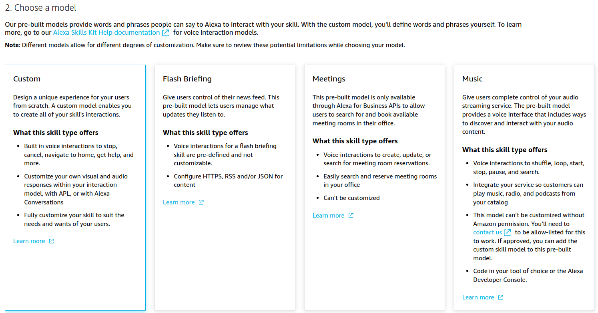

# Alexa GenAI

[](https://opensource.org/licenses/MIT)

[English](#english) | [日本語](#japanese)

## <a name="english"></a>English

Enhance your Alexa with advanced Generative AI capabilities.

This repository contains an Alexa skill that integrates with OpenAI's API to provide intelligent, context-aware responses using state-of-the-art language models.

<div align="center">
  
</div>

## Prerequisites

- An [Amazon Developer account](https://developer.amazon.com/)
- An [OpenAI API key](https://platform.openai.com/api-keys)

## Quick Start - Import from GitHub

### 1.
Log in to your Amazon Developer account and navigate to the [Alexa Developer Console](https://developer.amazon.com/alexa/console/ask).

### 2.
Click on "Create Skill" and name the skill "GenAI". Choose the primary locale according to your language.


### 3.
Choose "Other" and "Custom" for the model.




### 4.
Choose "Alexa-hosted (Python)" for the backend resources.


### 5.
Click on "Import Skill", paste the link of this repository and click on "Import":
```
https://github.com/evolution1204/alexa-genai.git
```


### 6.
After import, the skill will be configured with:
- Invocation name: "genai"
- Support for multiple languages (15+ locales)
- Pre-configured intents and interaction model

### 7.
Add your OpenAI API key:
- Navigate to the "Code" section
- Open `lambda/lambda_function.py`
- Replace `YOUR_API_KEY` with your actual OpenAI API key


### 8.
Save and deploy. Go to "Test" section and enable "Skill testing" in "Development".


### 9.
You are now ready to use your Alexa GenAI skill! Try saying:
- "Alexa, open genai"
- "Alexa, ask genai [your question]"


## Manual Setup (Alternative)

If you prefer to set up the skill manually:

### 1. Create the Skill
Follow steps 1-4 from the Quick Start guide, but select "Start from Scratch" instead of importing.

### 2. Configure Interaction Model
In the "Build" section, navigate to the "JSON Editor" tab and replace with the content from `json_editor.json`.

### 3. Update Lambda Function
- Go to "Code" section
- Replace `lambda_function.py` with the provided code
- Update `requirements.txt` with the dependencies

### 4. Build and Deploy
- Save the model and click on "Build Model"
- Deploy your code changes

## Features

- **Powered by GPT-5**: Utilizes OpenAI's latest GPT-5 models (released August 2025) for state-of-the-art AI responses
- **Multi-language Support**: Works in 15+ languages including English, Spanish, French, German, Japanese, and more
- **Context Awareness**: Maintains conversation history for contextual responses
- **Advanced Reasoning**: Leverages GPT-5's built-in thinking and reasoning capabilities for more intelligent interactions
- **Customizable**: Easy to modify prompts and behavior
- **Model Options**: Choose between GPT-5, GPT-5-mini, or GPT-5-nano based on your needs and budget

## Configuration

### GPT-5 Model Details

GPT-5 was released in August 2025 and offers three variants:

| Model | Input Price | Output Price | Best For |
|-------|------------|--------------|----------|
| gpt-5 | $1.25/1M tokens | $10/1M tokens | Highest quality, complex reasoning |
| gpt-5-mini | $0.25/1M tokens | $2/1M tokens | Balanced performance and cost |
| gpt-5-nano | $0.05/1M tokens | $0.40/1M tokens | Fast, economical responses |

GPT-5 excels in:
- Math (94.6% on AIME 2025)
- Coding (74.9% on SWE-bench)
- Multimodal understanding (84.2% on MMMU)
- Health applications (46.2% on HealthBench)

### Customizing the Model
You can change the AI model in `lambda/lambda_function.py`:
```python
# Choose from three GPT-5 variants:
model = "gpt-5-mini"  # Default: balanced performance and cost

# Available models:
# - "gpt-5": Best performance ($1.25/1M input, $10/1M output)
# - "gpt-5-mini": Balanced ($0.25/1M input, $2/1M output)
# - "gpt-5-nano": Most economical ($0.05/1M input, $0.40/1M output)

data = {
    "model": model,
    "messages": messages,
    "max_tokens": 300,
    "temperature": 0.7,
    "reasoning_effort": "medium"  # GPT-5 specific: minimal, low, medium, or high
}
```

### Adjusting Response Length
Modify the system prompt in `lambda/lambda_function.py`:
```python
messages = [{"role": "system", "content": "You are a helpful assistant. Answer in 50 words or less."}]
```

## Cost Considerations

Running this skill will incur costs for:
- **AWS Lambda**: Execution costs (minimal for personal use)
- **OpenAI API**: Based on token usage
- **Alexa Hosting**: Free tier available

Monitor your usage to avoid unexpected charges.

## Contributing

Contributions are welcome! Please feel free to submit a Pull Request.

## License

This project is licensed under the MIT License - see the [LICENSE](LICENSE) file for details.

## Support

For issues, questions, or suggestions, please open an issue on GitHub.

## Acknowledgments

- Original concept inspired by alexa-gpt
- Built with the Alexa Skills Kit (ASK) SDK
- Powered by OpenAI's GPT-5 models (August 2025)

---

## <a name="japanese"></a>日本語

AlexaにGPT-5による高度な生成AI機能を追加します。

このリポジトリには、OpenAI APIと統合して最先端の言語モデルを使用したインテリジェントで文脈を理解する応答を提供するAlexaスキルが含まれています。

### 必要条件

- [Amazon開発者アカウント](https://developer.amazon.com/)
- [OpenAI APIキー](https://platform.openai.com/api-keys)

### クイックスタート - GitHubからインポート

#### 1. Alexa Developer Consoleにログイン
[Alexa Developer Console](https://developer.amazon.com/alexa/console/ask)にアクセスしてログインします。

#### 2. スキルの作成
「スキルを作成」をクリックし、スキル名を「GenAI」にします。主要言語は日本語を選択します。

#### 3. モデルの選択
「その他」と「カスタム」を選択します。

#### 4. ホスティングサービス
「Alexa-hosted (Python)」を選択します。

#### 5. スキルのインポート
「スキルをインポート」をクリックし、このリポジトリのリンクを貼り付けて「インポート」をクリック：
```
https://github.com/[あなたのユーザー名]/alexa-genai.git
```

#### 6. インポート後の設定
- 呼び出し名: 「ジェンエーアイ」（genai）
- 15以上の言語対応
- 事前設定されたインテントとインタラクションモデル

#### 7. OpenAI APIキーの追加
- 「コード」セクションに移動
- `lambda/lambda_function.py`を開く
- `YOUR_API_KEY`を実際のOpenAI APIキーに置き換える

#### 8. デプロイとテスト
保存してデプロイします。「テスト」セクションで「開発中」のスキルテストを有効にします。

#### 9. 使用例
以下のように話しかけてください：
- 「アレクサ、ジェンエーアイを開いて」
- 「アレクサ、ジェンエーアイで[質問]」

### 機能

- **GPT-5搭載**: OpenAIの最新GPT-5モデル（2025年8月リリース）による最先端のAI応答
- **完全な日本語対応**: 自動言語検出と日本語での自然な対話
- **多言語サポート**: 15以上の言語に対応
- **文脈認識**: 会話履歴を維持した文脈に応じた応答
- **高度な推論**: GPT-5の組み込み思考・推論機能を活用したインテリジェントな対話
- **モデル選択**: GPT-5、GPT-5-mini、GPT-5-nanoからニーズと予算に応じて選択可能

### 日本語対応の特徴

- **自動言語検出**: 質問内容から日本語を自動検出
- **ローカライズされた応答**: 日本語での自然な応答とメッセージ
- **日本語のフォローアップ質問**: 会話を続けるための提案を日本語で生成
- **文脈に応じた敬語**: 適切な敬語レベルでの応答

### 設定のカスタマイズ

#### モデルの変更
`lambda/lambda_function.py`でAIモデルを変更できます：
```python
# 3つのGPT-5バリアントから選択：
model = "gpt-5-mini"  # デフォルト: バランス型

# 利用可能なモデル：
# - "gpt-5": 最高性能（$1.25/1M入力、$10/1M出力）
# - "gpt-5-mini": バランス型（$0.25/1M入力、$2/1M出力）
# - "gpt-5-nano": 最も経済的（$0.05/1M入力、$0.40/1M出力）
```

#### 応答の長さ調整
システムプロンプトを変更：
```python
# 日本語
system_message = "あなたは親切なアシスタントです。50文字以内で簡潔に答えてください。"

# 英語
system_message = "You are a helpful assistant. Answer in 50 words or less."
```

### コスト

このスキルの実行には以下のコストがかかります：
- **AWS Lambda**: 実行コスト（個人利用では最小限）
- **OpenAI API**: トークン使用量に基づく
- **Alexa Hosting**: 無料枠あり

使用量を監視して予期しない請求を避けてください。

### 貢献

プルリクエストは歓迎です！お気軽に提出してください。

### ライセンス

このプロジェクトはMITライセンスの下でライセンスされています。

### サポート

問題、質問、提案がある場合は、GitHubでissueを開いてください。